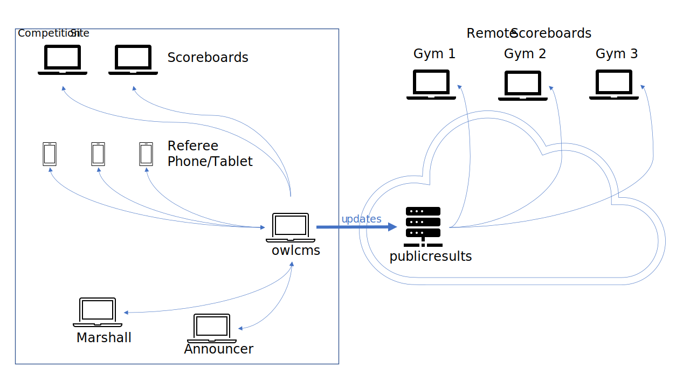

The `publicresults` application is used to make applications results available to the public at large, or to run virtual competitions. As shown in the following diagram (and further discussed in on [this page](Virtual):

- updates are sent from the competition site to  the publicresults application running on the cloud.  
- The general public, whether at the competition site or anywhere on the internet, can connect to publicresults and  see the scoreboards via their phone or laptop.  
- There is no load put on the competition site other than sending an update to the publicresults application.  The publicresults application takes all the load for the public queries.

## Cloud installation of `publicresults`

1. Get a free Heroku account -- go to [https://heroku.com](https://heroku.com) and sign up!

2. Click on this Button 

3. Enter your Heroku account (or create one if you haven't)

4. Enter a meaningful application name.  In the following example, we use `owlcms-test-publicresults` We will later use `owlcms-test-publicresults.herokuapp.com`  to see the results.  You should use a name that makes sense to your club or federation.

    *(Reminder: You can click on the images to make them bigger)*

    

5. Deploy the application. This will magically fetch the application from where you clicked on the `Deploy to Heroku` button, install it, and make it available to the public.
    

6. You can check that the application is running by starting a new browser tab. In our example, we connect to `https://owlcms-test-publicresults.herokuapp.com`
    

    
    
7. We now need to configure a secret code to keep communications secure between the competition site and the publicresults repeater.  Go to the `Settings` page for the application.
    

8. Create configuration variable `OWLCMS_UPDATEKEY` and set it to the secret key that will be shared with owlcms.  **Use something easy to type, but quite long**, and not easily guessed .  `abracadabra` as used below is *NOT* a good real-life example...
    

9. After installing publicresults, you need to configure owlcms to talk to it.  Refer to [these instructions](RunPublicResults)

## Local Installation of the `publicresults` Application

Normally, publicresults is installed in the cloud.  For testing purposes, or if there is a local Wifi setup at your competition site, you might want to run it locally.

1. If the competition site does not have an Internet link, you can setup a second laptop and use the `publicresults.exe` package from the release repository. 
2. To be safe, you should isolate the second laptop and the coaches from the competition network
   1. Get a second router and configure its DHCP address range to be different than your main router (do not connect it to the main router)
   2. Install a wire from one of the LAN ports of the main router to the WLAN port of a second router.
   3. Connect the second laptop to the second router using a wire.  It will be able to see the primary laptop via the wire.
   4. Note that if your main router has internet access the coaches will likely be blocked from reaching it unless you add additional default routes (or your router does it on its own).  But since this configuration is meant for the case where there is no internet access, that's probably just fine.

You will then edit the `publicresults.l4j.ini` in the installation directory, and uncomment the `-DupdateKey`  The rest of the setup is the same as for the cloud configuration.